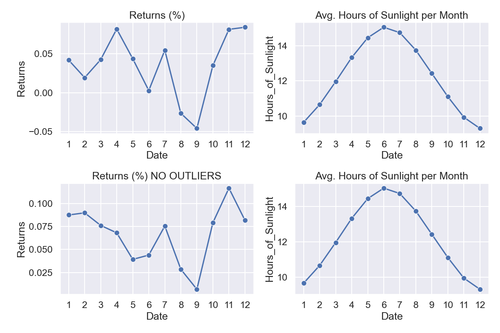

# Seasonal Affective Disorder & NYSE Returns
## Overview
This repository contain data, images and models which investigate the relationship between Seasonal Affective Disorder (SAD) and stock market returns within the Northern Hemisphere. Taking inspirations from the 2001 research paper [Winter Blues: Seasonal Affective Disorder (SAD) and Stock Market Returns](http://qed.econ.queensu.ca/faculty/mackinnon/econ872/papers/kamstra-kramer-levi.pdf), this research project seeks detail the unlikely relationship between the two variables and attempts the further the discoveries by creating the preliminary frameworks for a trading algorithm.
## Table of Contents

## Background 
The following are key points/takeaways from the hyperlinked research paper:
- SAD is a depressive disorder/condition which affects people during seasons with relatively few hours of sunlight, mainly fall and winter
    - Depression triggered by seasonal changes
- Studies have shown a clear correlation between emotion and risk preferences
    - People experiencing depression tend to be much more risk averse, behaving in a manner which minimizes any form of risk 

- Within financial trading, there is a positive correlation between risk and reward
    - Taking bigger risks raises the potential for greater returns/gains

__Hypothesis:__
Depressed investors suffering from SAD will experience higher risk aversion, shifting their attention away from risky securities, including stock, thereby resulting in lower average market returns during the winter/fall months

## Data Overview

## Exploratory Data Analysis
- distribution of data
- what each of them means and why it might be an issue
- variance of returns

### Findings
- Negative relationship between average monthly Returns and Hours of Sunlight
    - Following the Summer Solstice in June/July, days begin to shorten, resulting in fewer hours of sunlight
        - As hours of sunlight decrease, market returns begin to rise
    - Following the Winter Solstice in late Dec, days become longer
        - As hours of sunlight increase, market returns gradually decline

- Months with fewer HOS in which SAD takes full effect, investor behaviour begins to alter towards risk aversion, requiring higher returns on investment to justify holding risky securities

- During months with greater HOS, investors become riskier meaning they are unbothered by the presence of risky securities within their portfolios
    - Optimism results in the acceptance of potentially lower/negative returns in hopes of future portfolio appreciation

    

 __Note:__ Removing outliers mitigates the "January Effect" 

## Machine Learning Models

### Clustering
What if hours of sunlight was not the only trigger of seasonal depression? 
UML techniques had been implemented to examine the differences in market returns between different types of days
- Kmeans clustering had been used to seperate trading days based soley on weather conditions
    - The 'Elbow Method' was used to calculate the optimal number of clusters
        - k = 3
- 
   

### Classification 

### Future Development
- Apply EDA process and models on data within the Southern Hemisphere to see if correlations still hold true
    - Inversed daylight cycles in the Southern Hemisphere
- Further hyperparameter tuning of classification model to increase accuracy and further reduce false positives
- With refined classification model, develop and implement a trading algorithm, tracking performance 