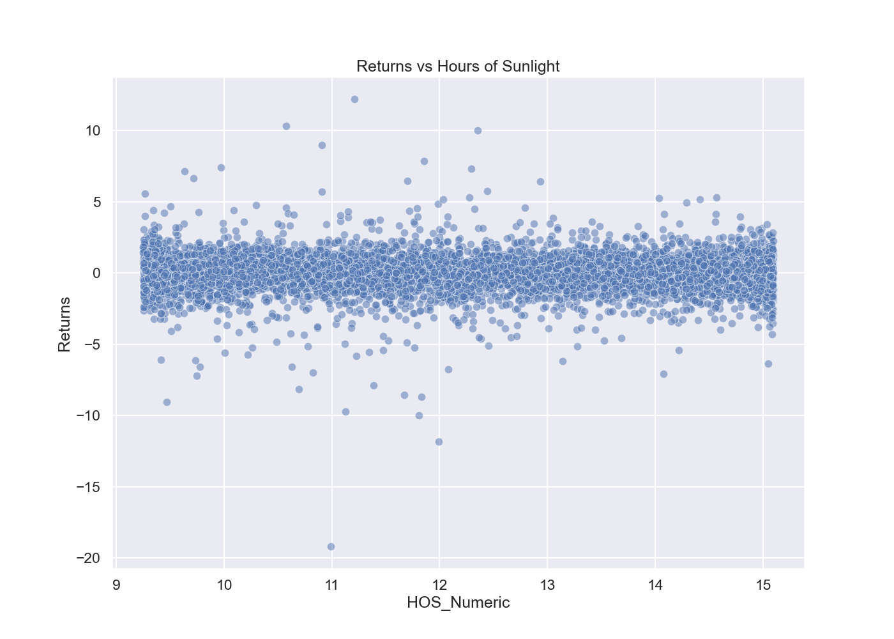
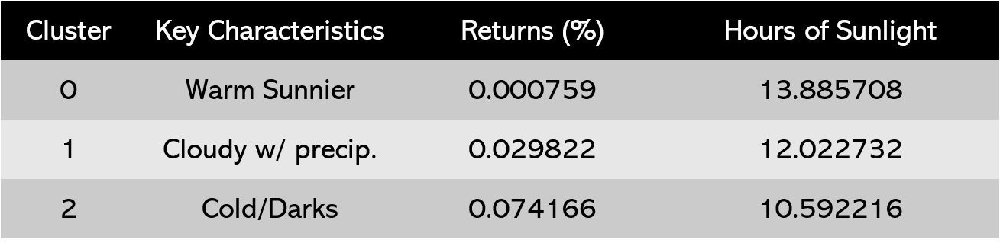

# Seasonal Affective Disorder & NYSE Returns
## Overview
This repository contains data, images and models which investigate the relationship between Seasonal Affective Disorder (SAD) and stock market returns within the Northern Hemisphere. Taking inspirations from the 2001 research paper [Winter Blues: Seasonal Affective Disorder (SAD) and Stock Market Returns](http://qed.econ.queensu.ca/faculty/mackinnon/econ872/papers/kamstra-kramer-levi.pdf), this research project seeks detail the unlikely relationship between the two variables and attempts the further the discoveries by creating the preliminary frameworks for a trading algorithm.

## Background 
The following are key points/takeaways from the hyperlinked research paper:
- SAD is a depressive disorder/condition which affects people during seasons with relatively few hours of sunlight, mainly fall and winter
    - Depression triggered by seasonal changes
- Studies have shown a clear correlation between emotion and risk preferences
    - People experiencing depression tend to be much more risk averse, behaving in a manner which minimizes any form of risk 
- Within financial trading, there is a positive correlation between risk and reward
    - Taking bigger risks raises the potential for greater returns/gains

__Hypothesis:__
Depressed investors suffering from SAD will experience higher risk aversion, shifting their attention away from risky securities, including stock, thereby resulting in lower average market returns during the winter/fall months

## Data Overview
- NYCweather1985toNov23.csv
    - New York City historical weather data from Jan 1, 1985 to Nov 22, 2023
    - 30+ weather variables 
    - Acquired from [Viral Crossing](https://www.visualcrossing.com/)
- NYSE_1985to2023.csv
    - NYSE Composite data from Jan 2, 1985 to Nov 22, 2023
    - Acquired from [Yahoo Finance](https://finance.yahoo.com/quote/%5ENYA/)
- NYSE_Weather.csv
    - NYSE Composite data, including returns, and daily weather conditions for NYC
    - All Trading days (252 per year) from Jan 3, 1985 to Nov 22, 2023
        - Only includes days in which the NYSE was open

## Exploratory Data Analysis
- NYSE 'Open' and 'Close' have similar distributions mainly due to their strong correlation
    - To be expected with stock data
- 'precip' and 'snow' variables have many nulls
    - Replaced with 0s
- 'Volume is rightward skewed
    - Missing information around the composite's conception (1985 onward)
    - Volume gradually increases over time, expect the skewness to exist perpetually
- Returns is not evenly distributed
    - Potentially due to presence of outliers
    - An issue when calculating/interpreting information utilizing means
    - Distribution much more resembles a normal distribution once outliers are removed

- Variance of returns is greater during days with either extreme or minimal sunlight

### Findings
- Negative relationship between average monthly Returns and Hours of Sunlight
    - Following the Summer Solstice in June/July, days begin to shorten, resulting in fewer hours of sunlight
        - As hours of sunlight decrease, market returns begin to rise
    - Following the Winter Solstice in late Dec, days become longer
        - As hours of sunlight increase, market returns gradually decline
- Months with fewer HOS in which SAD takes full effect, investor behaviour begins to alter towards risk aversion, requiring higher returns on investment to justify holding risky securities
- During months with greater HOS, investors become riskier meaning they are unbothered by the presence of risky securities within their portfolios
    - Optimism results in the acceptance of potentially lower/negative returns in hopes of future portfolio appreciation
    

 __Note:__ Removing outliers mitigates the "January Effect" - the annual fall and subsequent rise of security markets during December and January respectively. A practice adopted by many corporations in which the firms sell-off all 'losing' investments for taxation purposes, later repurchasing at the beginning of the next fiscal year.

## Machine Learning Models

### Clustering
What if hours of sunlight was not the only trigger of seasonal depression? 
UML techniques had been implemented to examine the differences in market returns between different types of days
- Kmeans clustering had been used to separate trading days based solely on weather conditions
    - The 'Elbow Method' was used to calculate the optimal number of clusters
        - k = 3
Each cluster possessed unique characteristics and market returns for each group varied drastically
   
- Warmer days, likely in Spring/summer (seasons with typically more HOS) exhibited the lowest returns
- Cool/Cloudier days exhibited slightly higher returns
- Cold days, likely in Fall/Winter (season with much less sun), exhibited the highest returns on average

### Classification 
Utilizing the previously discovered information, a classification model was generated which took weather information as inputs, generating "Buy/Hold" and "Sell" recommendations accordingly
- __Goal:__ Create a algorithm in which the user inputs future weather forecasts and the model would provide financial recommendations for present action
- Utilizing Random Forests
- Focuses on minimizing false positives
    - Instances in which the model predicts "Buy/Hold" when the true prediction is "Sell"
    - Only instance which poses a real financial cost to the user

__Evaluation Metrics__ 
- Accuracy: 0.73
- Precision: 0.77
- Recall: 0.91
- F1-Score: 0.83
- ROC-AUC 0.63

### Future Development
- Apply EDA process and models on data within the Southern Hemisphere to see if correlations still hold true
    - Inversed daylight cycles in the Southern Hemisphere
- Further hyperparameter tuning of classification model to increase accuracy and further reduce false positives
- With refined classification model, develop and implement a trading algorithm, tracking performance 